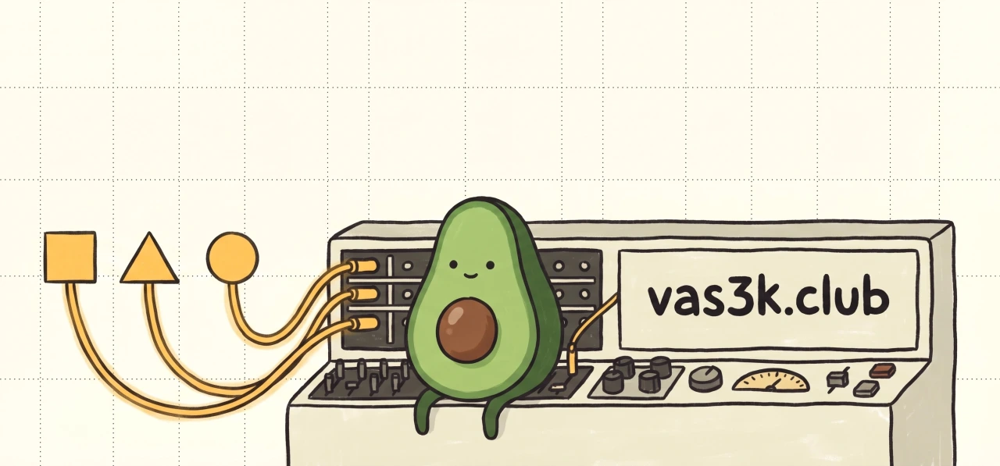

<p align="center">
  
</p>

# vas3k-mcp

A remote [Model Context Protocol](https://modelcontextprotocol.io) server for
the [vas3k.club](https://vas3k.club) community, deployed on
[Cloudflare Workers](https://developers.cloudflare.com/workers/). It exposes
the club's JSON API (profiles, posts, comments, search, feed) as MCP tools and
delegates user authentication to the club's own OAuth2 / OpenID Connect
provider.

> Built with [`agents`](https://github.com/cloudflare/agents) (`McpAgent`),
> [`@cloudflare/workers-oauth-provider`](https://github.com/cloudflare/workers-oauth-provider)
> (dual-OAuth bridge), and [`hono`](https://hono.dev/) (HTTP routing).

## Two ways to use it

There's a public deployment at **`https://vas3k-mcp.rmbk.me`** that I run for
my own use and don't promise any uptime / SLA / scale on. If you find it
useful, great; if you'd rather control the infra, deploying your own copy
takes ~10 minutes on Cloudflare's free tier.

| | **Public deployment** | **Your own copy** |
| --- | --- | --- |
| Setup | Paste a URL into Claude. Done. | Fork → register a vas3k.club app → push 3 secrets → `pnpm deploy`. |
| Cost | Free | Free (Cloudflare's generous tier) |
| Trust | You trust *me* (the repo author) to not poke at refresh tokens. They're encrypted with a per-deployment key in KV, but encryption isn't a substitute for trust. | Only you. Tokens never leave your account. |
| Reliability | Best-effort. One shared CF deployment, single shared rate-limit budget vs vas3k.club. May disappear without notice. | Yours. Independent rate-limit. |
| Updates | Auto-deployed from `main`. | You `git pull && pnpm deploy`. |

### Public deployment

Add to your MCP client config:

```jsonc
{
  "mcpServers": {
    "vas3k": {
      "url": "https://vas3k-mcp.rmbk.me/mcp"
    }
  }
}
```

On first connect the client opens a browser → vas3k.club asks you to sign in
and approve → you're back with a working session. Revoke any time at
<https://vas3k.club/apps/>.

### Your own copy

See [Self-host on Cloudflare Workers](#self-host-on-cloudflare-workers) below.

## Tools

| Tool                          | What it does                                      |
| ----------------------------- | ------------------------------------------------- |
| `get_me`                      | Authenticated member's profile                    |
| `get_user(slug)`              | Profile by URL slug                               |
| `get_user_tags(slug)`         | Topical tags on a profile                         |
| `get_user_badges(slug)`       | Peer-awarded badges                               |
| `get_user_achievements(slug)` | Achievements / milestones                         |
| `find_user_by_telegram(id)`   | Reverse-lookup by Telegram id                     |
| `get_post(post_type, slug)`   | Full post (JSON)                                  |
| `get_post_markdown(...)`      | Raw markdown body                                 |
| `list_post_comments(...)`     | Visible comments under a post                     |
| `get_feed(post_type, ...)`    | Paginated feed                                    |
| `search_users(prefix)`        | Find members by slug prefix                       |
| `search_tags(prefix, group)`  | Search profile tags                               |

`post_type`: `post` · `link` · `project` · `question` · `idea` · `event` · `battle` · `guide` · `thread` · `intro` · `gallery` · `weekly_digest` · `referral`.
`ordering`: `activity` (default) · `new` · `top` · `top_week` · `top_month` · `top_year` · `hot`.

## Self-host on Cloudflare Workers

Free tier on Cloudflare is generous; you'll likely never pay for this.

### 1. Clone & install

```sh
git clone https://github.com/uburuntu/vas3k-mcp
cd vas3k-mcp
pnpm install
```

### 2. Provision Cloudflare resources

```sh
npx wrangler login
npx wrangler kv namespace create vas3k-mcp-oauth
```

Paste the returned KV id into `wrangler.jsonc` (replace the existing one).

### 3. Register an OAuth app on vas3k.club

Sign in to vas3k.club, then go to <https://vas3k.club/apps/create/>:

| Field | Value |
| --- | --- |
| Название приложения | `Vas3k MCP (your-handle)` |
| Описание | _short user-facing blurb that appears on the OAuth approval page — see the hosted app at https://vas3k.club/apps/ for a reference style_ |
| URL вашего сайта или бота | `https://github.com/<you>/vas3k-mcp` |
| Разрешённые Callback URL | `https://vas3k-mcp.<your-cf-subdomain>.workers.dev/callback, http://127.0.0.1:8788/callback` |

The second URL covers `pnpm dev`. Find your `<your-cf-subdomain>` with:

```sh
curl -H "Authorization: Bearer $(grep oauth_token ~/Library/Preferences/.wrangler/config/default.toml | cut -d'"' -f2)" \
  "https://api.cloudflare.com/client/v4/accounts/<account-id>/workers/subdomain"
```

(account id from `npx wrangler whoami`). Or just deploy once with placeholders,
note the printed URL, edit the app.

After saving you'll see **Client ID** and **Client Secret** on the app page —
needed in step 4. (The page also lists a **Service Token**; we don't use it,
that's a different auth shape.)

### 4. Push secrets

```sh
# Interactive prompts — values won't land in your shell history.
npx wrangler secret put VAS3K_CLIENT_ID
npx wrangler secret put VAS3K_CLIENT_SECRET
# Generate a fresh 32-byte hex key and paste it into the prompt below
# (don't pipe via stdin if you care about not leaking it through history):
openssl rand -hex 32
npx wrangler secret put COOKIE_ENCRYPTION_KEY
```

`COOKIE_ENCRYPTION_KEY` encrypts the per-session `props` (vas3k.club access +
refresh tokens) inside the bearer tokens this worker hands to MCP clients.
Treat it like a password; rotating it logs everyone out.

### 5. Deploy

```sh
pnpm deploy
```

The first deploy prints your Worker URL. Copy it back into the vas3k.club app
settings as the redirect URI, then redeploy.

## Local development

```sh
cp .dev.vars.example .dev.vars   # fill in client id/secret/cookie key
pnpm dev                         # http://127.0.0.1:8788
```

If your vas3k.club app already lists `http://127.0.0.1:8788/callback` as one
of its callbacks (recommended in step 3 above), reuse the same `CLIENT_ID` /
`CLIENT_SECRET` for `.dev.vars`. Otherwise register a separate dev-only app.

## Environment

| Var                     | Where    | Purpose                                                      |
| ----------------------- | -------- | ------------------------------------------------------------ |
| `VAS3K_BASE_URL`        | `vars`   | vas3k.club host (default `https://vas3k.club`)               |
| `VAS3K_CLIENT_ID`       | secret   | OAuth client id from vas3k.club app                          |
| `VAS3K_CLIENT_SECRET`   | secret   | OAuth client secret from vas3k.club app                      |
| `COOKIE_ENCRYPTION_KEY` | secret   | 32-byte hex key — encrypts `props` inside MCP-issued tokens  |
| `OAUTH_KV`              | binding  | KV (dashboard title `vas3k-mcp-oauth`); name hardcoded by lib |
| `MCP_OBJECT`            | binding  | Durable Object for `McpAgent` per-session storage            |

## Architecture

```
   MCP client (Claude Desktop / Code / Cursor)
        │  Bearer token issued by us (props encrypted into it)
        ▼
   ┌──────────────────────── Worker ────────────────────────┐
   │ OAuthProvider (@cloudflare/workers-oauth-provider)     │
   │   ├── /authorize, /token, /register  (MCP-side OAuth)  │
   │   ├── /authorize, /callback          (Hono → vas3k)    │
   │   └── /mcp  ─►  MyMCP : McpAgent  (12 tools)           │
   └────────────────────────────────────────────────────────┘
                                │
                                ▼
                       vas3k.club JSON API
```

The Worker plays two OAuth roles at once:

- **Provider** to MCP clients — they OAuth with the worker, receive a bearer.
- **Client** to vas3k.club — the worker exchanges its own credentials for
  upstream tokens during `/callback`. The upstream access + refresh tokens are
  stored as encrypted `props` inside the MCP-side bearer.

When the MCP client refreshes its token, `tokenExchangeCallback` transparently
refreshes the upstream vas3k.club token too, so sessions stay alive across
upstream-token expiry without a re-auth round-trip.

## CI / CD

- **`.github/workflows/ci.yml`** — on every PR and main push: biome lint,
  TypeScript type-check, vitest unit tests, `wrangler deploy --dry-run`.
  10-minute job timeout.
- **`.github/workflows/contract.yml`** — PR / main / weekly cron / dispatch:
  spins up the real vas3k.club Django backend and runs zod-schema contract
  tests against it. The cron is gated to the canonical repo so forks don't
  burn minutes on it.
- **`.github/workflows/deploy.yml`** — on main push (only when `src/`,
  `wrangler.jsonc`, the lockfile, or the workflow itself change — README-only
  commits no longer redeploy) plus `workflow_dispatch`: deploy to Cloudflare
  via `cloudflare/wrangler-action`. 15-minute job timeout. Requires repo
  secrets `CLOUDFLARE_API_TOKEN` (Workers · Edit) and `CLOUDFLARE_ACCOUNT_ID`.
- **`.github/dependabot.yml`** — weekly SHA bumps for `github-actions` and
  weekly grouped minor+patch bumps for npm.

Third-party actions (`cloudflare/wrangler-action`, `pnpm/action-setup`,
`astral-sh/setup-uv`) are pinned to a full commit SHA with a version comment
so a tag re-point can't ship attacker-controlled code into a job that holds
`CLOUDFLARE_API_TOKEN`. GitHub-owned `actions/*` are left at floating major
tags. Dependabot opens PRs for the pinned SHAs weekly.

### Required reviewers on the `production` environment

Declaring `environment: production` in the workflow only binds the job to the
environment so it can read environment secrets — it does **not** by itself
require a human to approve the deploy. To enforce that:

1. Repo Settings → Environments → `production` (create it if missing).
2. Tick **Required reviewers**, add at least one user/team, and enable
   **Prevent self-review**.
3. Optionally set **Deployment branches** to `main` only and a small **Wait
   timer** so a bad merge can be cancelled before it ships.

Without that rule, every qualifying push to `main` ships to prod immediately.

### Cloudflare auth: API token today, OIDC preferred

The deploy uses a static `CLOUDFLARE_API_TOKEN` repo secret. This works but
is a long-lived credential — if it leaks, an attacker has standing
`Workers:Edit` on the account until you rotate manually. Cloudflare supports
OIDC federation with GitHub Actions, where each run mints a short-lived
token scoped to the workflow. The OIDC entry-point on the workflow side is
adding `id-token: write` to `permissions:` and removing the static `apiToken`
input from the wrangler-action step. Cloudflare's general CI/CD docs at
<https://developers.cloudflare.com/workers/ci-cd/external-cicd/github-actions/>
cover the API-token flow used here; check the Cloudflare dashboard (My
Profile → API Tokens) for the OIDC trust-policy UI when you're ready to
migrate.

### Self-hosters: DCR is open, hardened by CIMD + consent UI

The worker keeps RFC 7591 dynamic client registration **enabled** (the MCP
spec requires it; disabling it locks out MCP Inspector / Claude Desktop /
Cursor). To keep the phishing surface manageable, the worker sets
`clientIdMetadataDocumentEnabled: true` (so well-behaved clients can use a
stable HTTPS URL as their `client_id`) and the `/authorize` consent screen
explicitly warns that the application name is self-declared by the
registering client and surfaces both the `client_id` and `redirect_uri`
verbatim. If you want to lock down further on a private deploy, set
`disallowPublicClientRegistration: true` in `src/index.ts` and pre-register
each client via `OAuthProvider.createClient`.

## License

[MIT](./LICENSE).
